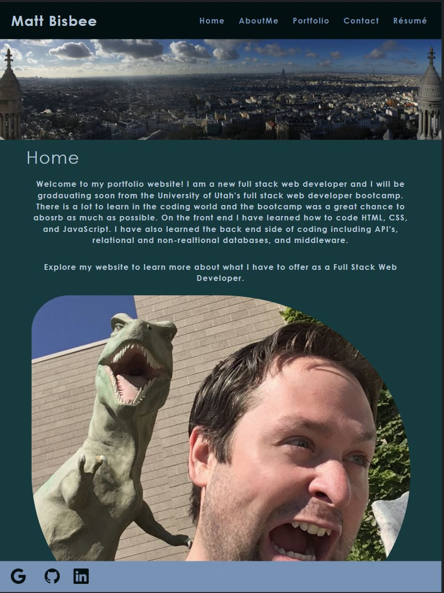

  # My Portfolio

  ## **Description**
  This is my portfolio and was made with React. It is a SPA site that has an About Me, Portfolio, Contact, and Resume section. Each section has different content but the nav and footer remain the same. 

  ## **Images**
  
  
  ## **Table of Contents**
  
  * [Usage](#usage)
  * [License](#license)
  * [Site](#site)
  * [Languages](#languages)
  * [Technology](#technology)
  * [Contribute](#contribute)
  
  ## **Usage**
  Click the link and navigate through the site to view all the content.

  ## **License**
  
   
  https://opensource.org/licenses/MIT
   

  ## **Site**
  https://mattbisbee.github.io/my-portfolio/

  ## **Languages**
   CSS, HTML, JavaScript, React

  ## **Technology**
  https://reactjs.org/

  ## **Contribute**
  Find me on [GitHub](https://www.github.com/mattbisbee)
   
  Send me an [Email](mailto:aldhelm7@gmail.com)
   
  [Contributor Covenant](https://www.contributor-covenant.org/)
